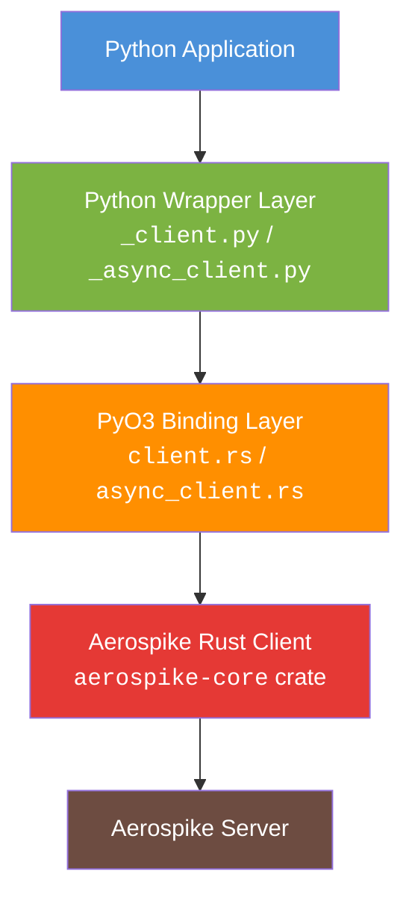
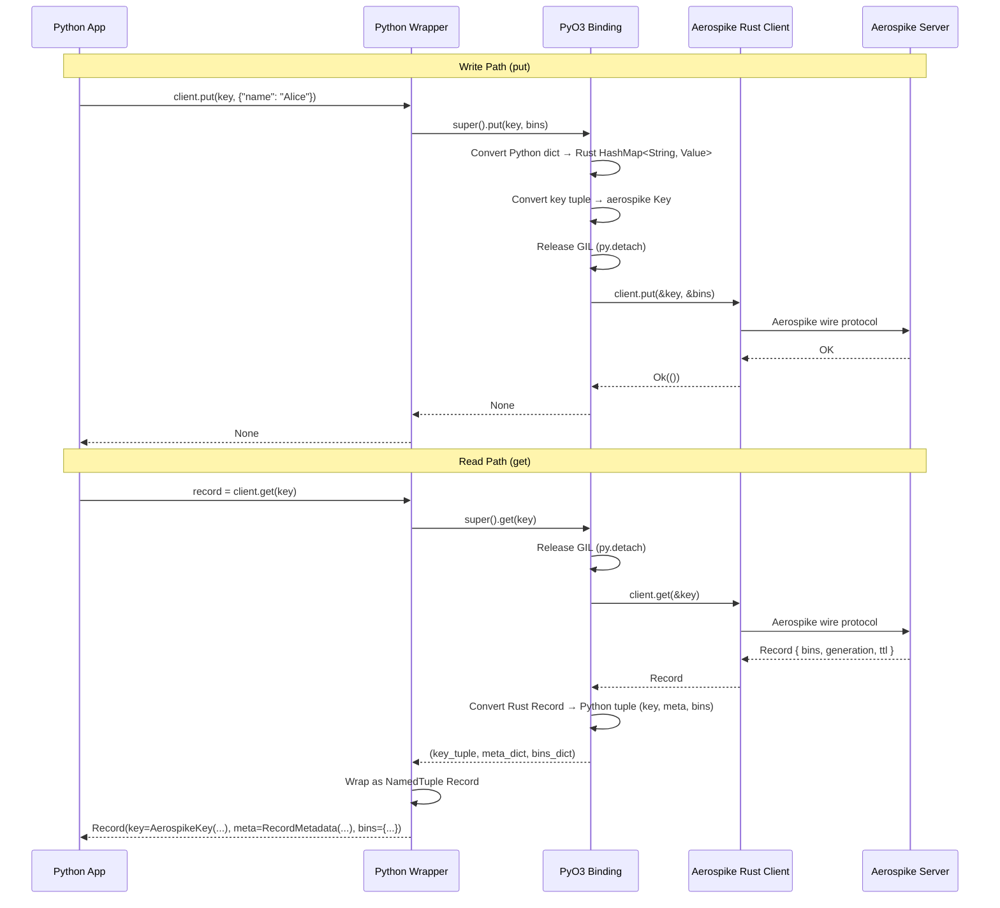

# Architecture

aerospike-py is a Python client for Aerospike built on top of the [Aerospike Rust Client](https://github.com/aerospike/aerospike-client-rust) using [PyO3](https://pyo3.rs). The native Rust core is compiled into a Python extension module (`aerospike_py._aerospike`), giving Python applications near-native performance while retaining a Pythonic API.

## Layer Diagram



| Layer | Language | Role |
|-------|----------|------|
| **Python Application** | Python | User code that imports `aerospike_py` |
| **Python Wrapper** | Python | Thin wrappers that convert raw tuples into `NamedTuple` results (`Record`, `ExistsResult`, etc.) and add context-manager support |
| **PyO3 Binding** | Rust | `#[pyclass]` / `#[pymethods]` that bridge Python calls to the async Rust client, handling GIL management and type conversion |
| **Aerospike Rust Client** | Rust | The `aerospike-core` crate -- a fully async client that speaks the Aerospike wire protocol |
| **Aerospike Server** | C | The database server |

## GIL Management

Python's Global Interpreter Lock (GIL) must be carefully managed so that database I/O does not block other Python threads.

### Sync Client

The sync `Client` subclasses the native `PyClient` (a `#[pyclass(subclass)]`). Each operation follows this pattern:

```
Python call  -->  PyO3 method
                    |
                    +-- py.detach()          // release the GIL
                    +-- RUNTIME.block_on()   // run the async operation on Tokio
                    +-- GIL re-acquired      // PyO3 re-acquires the GIL on return
                    +-- convert result to Python objects
```

Because the GIL is released during the Tokio `block_on` call, other Python threads can execute concurrently while the database I/O is in progress.

### Async Client

The async `AsyncClient` wraps a native `PyAsyncClient`. Each operation uses `pyo3_async_runtimes::tokio::future_into_py()` to turn a Rust `Future` into a Python awaitable:

```
Python await  -->  PyO3 method
                     |
                     +-- future_into_py()    // schedule future on Tokio runtime
                     +-- returns Python awaitable immediately
                     |
                     (Tokio worker completes I/O)
                     |
                     +-- Python::attach()    // re-acquire the GIL
                     +-- convert result to Python objects
                     +-- resolve the awaitable
```

This allows full integration with `asyncio` event loops without blocking.

## Tokio Runtime

aerospike-py maintains two Tokio runtimes internally:

1. **Sync runtime** (`RUNTIME`) -- a `LazyLock<tokio::runtime::Runtime>` used by the sync `Client` via `block_on()`. Lazily initialized on first use.
2. **Async runtime** -- configured during module init via `pyo3_async_runtimes::tokio::init()`, used by `AsyncClient` via `future_into_py()`.

Both default to **2 worker threads**, configurable via the `AEROSPIKE_RUNTIME_WORKERS` environment variable (minimum 1).

**Why 2 workers?** Aerospike operations are I/O-bound, and Tokio uses cooperative scheduling. Fewer workers means fewer threads competing for the GIL after async I/O completes, which dramatically reduces GIL contention under high concurrency. For most workloads, 2 workers is optimal.

```bash
# Adjust if needed (e.g., very high concurrency with CPU-heavy serialization)
export AEROSPIKE_RUNTIME_WORKERS=4
```

## Data Flow

The following sequence diagram shows how data flows through the layers during a `put` and `get` operation:



### Type Conversion Summary

| Direction | From | To |
|-----------|------|----|
| Python to Rust | `int` | `Value::Int(i64)` |
| Python to Rust | `float` | `Value::Float(f64)` |
| Python to Rust | `str` | `Value::String` |
| Python to Rust | `bytes` | `Value::Blob` |
| Python to Rust | `list` | `Value::List` |
| Python to Rust | `dict` | `Value::HashMap` |
| Python to Rust | `bool` | `Value::Bool` |
| Python to Rust | `None` | `Value::Nil` |
| Rust to Python | `Value` types | Corresponding Python types |
| Rust to Python | `Record` | `(key_tuple, meta_dict, bins_dict)` raw tuple, wrapped as `Record` NamedTuple by the Python layer |

## Error Handling

Errors from the Aerospike Rust client are mapped to a Python exception hierarchy that mirrors the Aerospike error taxonomy:

```
AerospikeError (base)
  +-- ClientError          (connection, config, internal)
  +-- ServerError          (server-side errors)
  |     +-- AerospikeIndexError
  |     |     +-- IndexNotFound
  |     |     +-- IndexFoundError
  |     +-- QueryError
  |     +-- QueryAbortedError
  |     +-- AdminError
  |     +-- UDFError
  +-- RecordError          (record-level)
  |     +-- RecordNotFound
  |     +-- RecordExistsError
  |     +-- RecordGenerationError
  |     +-- RecordTooBig
  |     +-- BinNameError
  |     +-- BinExistsError
  |     +-- BinNotFound
  |     +-- BinTypeError
  |     +-- FilteredOut
  +-- ClusterError         (node/connectivity)
  +-- AerospikeTimeoutError
  +-- InvalidArgError
```

The mapping happens in `rust/src/errors.rs`: each Aerospike `ResultCode` is matched to the corresponding Python exception class. The error message from the Rust client is preserved in the Python exception.

```python
from aerospike_py import RecordNotFound

try:
    record = client.get(("test", "demo", "missing_key"))
except RecordNotFound as e:
    print(f"Record not found: {e}")
```

## Observability

aerospike-py has built-in observability through three pillars:

### OpenTelemetry Tracing

Every database operation is automatically instrumented with an OTel span via the `traced_op!` macro. Spans include:

- `db.system.name`: `"aerospike"`
- `db.namespace`: the target namespace
- `db.collection.name`: the target set
- `db.operation.name`: e.g., `"GET"`, `"PUT"`, `"BATCH_READ"`
- `server.address` / `server.port`: seed host info
- `error.type`: set on failure

To enable tracing, install the OTel SDK and initialize:

```python
from aerospike_py import init_tracing, shutdown_tracing

init_tracing()  # configures OTLP exporter using OTEL_* env vars

# ... use client ...

shutdown_tracing()  # flush pending spans
```

W3C TraceContext propagation is supported, allowing traces to flow from Python application spans through to Aerospike operations.

### Prometheus Metrics

Operation durations are recorded as histograms (`db_client_operation_duration_seconds`) with labels for system, namespace, collection, operation, and error type.

```python
from aerospike_py import get_metrics, start_metrics_server, stop_metrics_server

# Option 1: Get metrics text programmatically
print(get_metrics())

# Option 2: Start a built-in HTTP server
start_metrics_server(9090)  # GET http://localhost:9090/metrics
# ...
stop_metrics_server()
```

Metrics collection can be toggled at runtime with `set_metrics_enabled(False)` for benchmarking scenarios where even the ~1ns atomic check overhead is undesirable.

### Logging

Rust internal logs are bridged to Python's `logging` module:

```python
from aerospike_py import set_log_level, LOG_LEVEL_DEBUG

set_log_level(LOG_LEVEL_DEBUG)
```

## Design Principles

1. **Rust-first**: Core logic lives in Rust. The Python layer is a thin wrapper for ergonomics (NamedTuples, context managers, factory functions).
2. **Zero Python dependencies**: The base install has no external Python dependencies. NumPy and OpenTelemetry are optional extras.
3. **Type-safe**: `.pyi` stub files provide full IDE autocompletion and type checker support.
4. **API compatibility**: Method signatures, constants, and exceptions align with the official Aerospike C client for Python where practical.
5. **NamedTuple returns**: Compound results use Python NamedTuples for named field access (`record.bins`, `record.meta.gen`).
