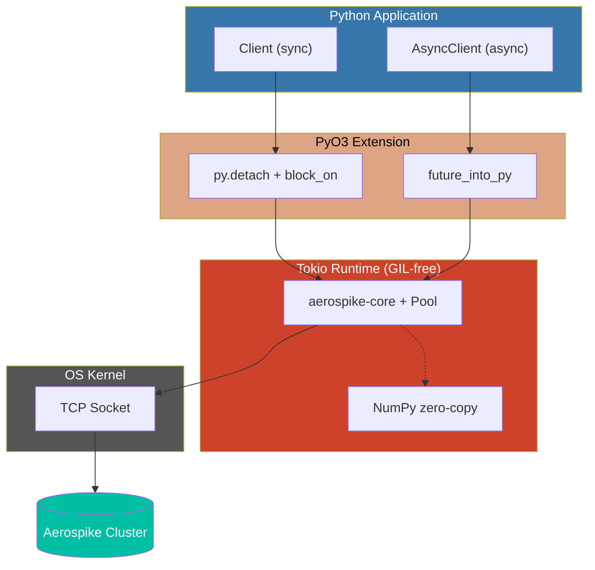

## Architecture



### Key Design

- **GIL release**: Both clients release GIL before Rust I/O. Sync uses `py.detach()` + `RUNTIME.block_on()`, async uses `future_into_py()`
- **Single Tokio runtime**: Global multi-threaded runtime shared across all clients. Default 2 worker threads (I/O-bound). Override with `AEROSPIKE_RUNTIME_WORKERS` env var
- **Zero-copy NumPy**: `batch_read(..., _dtype=dtype)` writes directly into numpy buffer via raw pointers -- no intermediate Python objects
- **Connection pooling**: Managed by `aerospike-core` with configurable `max_conns_per_node` and `idle_timeout`

## Benchmark Methodology

1. **Warmup phase** -- results excluded
2. **Multiple rounds** -- median of medians with IQR outlier trimming
3. **Pre-seeded data** for reads
4. **GC disabled** during measurement
5. **Isolated key prefixes** per client
6. **CPU time separation** -- `thread_time()` vs `perf_counter()` for CPU vs I/O breakdown (measures calling thread only, excludes Tokio workers)
7. **Extended percentiles** -- p50, p75, p90, p95, p99, p99.9

## Comparison

| Client | Runtime |
|--------|---------|
| aerospike-py (sync) | Rust + Python |
| aerospike-py (async) | Rust + Python |
| official aerospike | C + Python |

## Benchmark Scenarios

### Basic (default)

Standard operation benchmarks: PUT, GET, OPERATE, REMOVE, BATCH_READ, BATCH_WRITE, SCAN.
Measures latency, throughput, stability (stdev, MAD), tail latency, and CPU time breakdown.

### Data Size Scaling

Measures PUT/GET latency across different record sizes with CPU time breakdown.

| Profile | Bins | Value Size |
|---------|------|-----------|
| tiny    | 3    | 10B       |
| small   | 5    | 10B       |
| medium  | 10   | 100B      |
| large   | 20   | 1KB       |
| xlarge  | 50   | 1KB       |

### Concurrency Scaling

Measures async throughput and per-op latency at concurrency levels: 1, 10, 50, 100, 200, 500.

### Memory Profiling

Peak memory per operation type across data sizes. Optionally compares with official C client.
Measured via Python's `tracemalloc`.

### Mixed Workload

Simulates realistic read/write mix with separate latency tracking per operation type.

| Ratio | Description |
|-------|------------|
| 90:10 | Read-heavy (typical web app) |
| 50:50 | Balanced |
| 10:90 | Write-heavy (ingestion pipeline) |

## Running Benchmarks

```bash
make run-benchmark                # Console output (basic only)
make run-benchmark-report         # Basic + JSON report for docs
make run-benchmark-full           # All scenarios + report
```

```bash
# Custom parameters
make run-benchmark BENCH_COUNT=10000 BENCH_ROUNDS=30 BENCH_CONCURRENCY=100

# Specific scenario
python benchmark/bench_compare.py --scenario data_size --count 2000 --rounds 5
python benchmark/bench_compare.py --scenario concurrency --count 1000 --rounds 10
python benchmark/bench_compare.py --scenario memory --count 1000
python benchmark/bench_compare.py --scenario mixed --count 1000 --rounds 10

# All scenarios
python benchmark/bench_compare.py --scenario all --count 2000 --rounds 5 --report
```

| Parameter | Default | Description |
|-----------|---------|-------------|
| `BENCH_COUNT` | 5,000 | Operations per round |
| `BENCH_ROUNDS` | 20 | Rounds per operation |
| `BENCH_CONCURRENCY` | 50 | Async concurrency |
| `BENCH_BATCH_GROUPS` | 10 | Batch read groups |

## Metrics

| Metric | Description |
|--------|-------------|
| avg_ms | Median of round means (lower is better) |
| p50/p75/p90/p95/p99/p99.9 | Percentile latencies |
| ops_per_sec | Median of round throughputs (higher is better) |
| stdev_ms | Stdev of round medians (lower = more stable) |
| mad_ms | Median Absolute Deviation (robust stability) |
| cpu_p50_ms | CPU time per operation (excludes I/O wait) |
| io_wait_p50_ms | I/O wait time (wall time - CPU time) |
| cpu_pct | CPU% of wall time (lower = more I/O bound) |

## Results

- [Benchmark Results](./benchmark-results) -- Basic + advanced profiling + NumPy batch comparison
