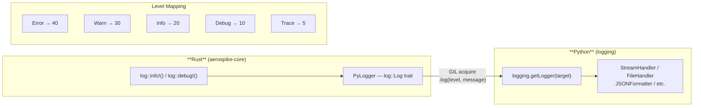

# 로깅

aerospike-py에는 Rust 내부 로그를 Python 표준 `logging` 모듈로 전달하는 **Rust-to-Python 로깅 브릿지**가 내장되어 있습니다. 애플리케이션의 나머지 부분과 동일한 로깅 설정으로 Aerospike 클라이언트 내부를 관찰할 수 있습니다.

## 아키텍처



브릿지는 모듈이 임포트될 때 자동으로 초기화됩니다. 별도의 설정이 필요하지 않습니다.

## 빠른 시작

```python
import logging
import aerospike_py

# aerospike-py의 디버그 레벨 출력 활성화
logging.basicConfig(level=logging.DEBUG)

client = aerospike_py.client({"hosts": [("127.0.0.1", 3000)]}).connect()
client.put(("test", "demo", "key1"), {"name": "Alice"})
```

출력:

```
DEBUG:aerospike_core::cluster: Connecting to seed 127.0.0.1:3000
DEBUG:aerospike_core::cluster: Node added: BB9...
DEBUG:aerospike_core::batch: put completed in 1.2ms
```

## 로그 레벨

`set_log_level()` 또는 `LOG_LEVEL_*` 상수를 사용하여 로그 상세도를 제어합니다:

```python
import aerospike_py

# 상수 사용
aerospike_py.set_log_level(aerospike_py.LOG_LEVEL_DEBUG)
```

| 상수 | 값 | Python 레벨 | 설명 |
|---|---|---|---|
| `LOG_LEVEL_OFF` | -1 | — | 모든 로깅 비활성화 |
| `LOG_LEVEL_ERROR` | 0 | `ERROR` (40) | 에러만 출력 |
| `LOG_LEVEL_WARN` | 1 | `WARNING` (30) | 경고 이상 출력 |
| `LOG_LEVEL_INFO` | 2 | `INFO` (20) | 정보성 메시지 |
| `LOG_LEVEL_DEBUG` | 3 | `DEBUG` (10) | 상세 디버깅 |
| `LOG_LEVEL_TRACE` | 4 | `TRACE` (5) | 와이어 레벨 추적 |

`set_log_level()`은 Rust 내부 로거와 Python 측 `aerospike_py` 로거를 동시에 설정합니다.

## 로거 이름

Rust 로그 타겟은 Python 로거 이름으로 직접 매핑됩니다:

| 로거 이름 | 설명 |
|---|---|
| `aerospike_core::cluster` | 클러스터 디스커버리, 노드 관리 |
| `aerospike_core::batch` | 배치 오퍼레이션 실행 |
| `aerospike_core::command` | 개별 커맨드 실행 |
| `aerospike_py` | Python 측 클라이언트 래퍼 |

각 로거를 독립적으로 설정할 수 있습니다:

```python
import logging

# 클러스터 레벨 이벤트만 표시
logging.getLogger("aerospike_core::cluster").setLevel(logging.DEBUG)
logging.getLogger("aerospike_core::batch").setLevel(logging.WARNING)
```

## 구조화된 JSON 로깅

프로덕션 환경에서는 JSON 포매터를 사용하여 머신에서 읽기 쉬운 로그를 생성합니다:

```python
import logging
import json

class JSONFormatter(logging.Formatter):
    def format(self, record):
        return json.dumps({
            "timestamp": self.formatTime(record),
            "level": record.levelname,
            "logger": record.name,
            "message": record.getMessage(),
        })

handler = logging.StreamHandler()
handler.setFormatter(JSONFormatter())

logger = logging.getLogger("aerospike_core")
logger.addHandler(handler)
logger.setLevel(logging.DEBUG)
```

출력:

```json
{"timestamp": "2025-01-15 10:30:00,123", "level": "DEBUG", "logger": "aerospike_core::cluster", "message": "Connecting to seed 127.0.0.1:3000"}
```

## 프레임워크 연동

### FastAPI

```python
import logging
from contextlib import asynccontextmanager

import aerospike_py
from fastapi import FastAPI

logging.basicConfig(
    level=logging.INFO,
    format="%(asctime)s %(name)s %(levelname)s %(message)s",
)

@asynccontextmanager
async def lifespan(app: FastAPI):
    aerospike_py.set_log_level(aerospike_py.LOG_LEVEL_INFO)
    client = aerospike_py.AsyncClient({"hosts": [("127.0.0.1", 3000)]})
    await client.connect()
    app.state.aerospike = client
    yield
    await client.close()

app = FastAPI(lifespan=lifespan)
```

### Django

```python
# settings.py
LOGGING = {
    "version": 1,
    "handlers": {
        "console": {"class": "logging.StreamHandler"},
    },
    "loggers": {
        "aerospike_core": {
            "handlers": ["console"],
            "level": "INFO",
        },
        "aerospike_py": {
            "handlers": ["console"],
            "level": "INFO",
        },
    },
}
```

## 파일 로깅

Aerospike 로그를 별도 파일로 라우팅합니다:

```python
import logging

file_handler = logging.FileHandler("aerospike.log")
file_handler.setFormatter(
    logging.Formatter("%(asctime)s %(levelname)s %(name)s %(message)s")
)

for name in ["aerospike_core", "aerospike_py"]:
    logger = logging.getLogger(name)
    logger.addHandler(file_handler)
    logger.setLevel(logging.DEBUG)
```

## 종료 시 폴백

Python GIL을 획득할 수 없는 상황(예: 인터프리터 종료 중)에서는 로깅 브리지가 Python으로 메시지를 전달할 수 없습니다. 이 경우:

- **WARN, ERROR** 메시지는 **stderr**로 출력되어 중요한 진단 정보가 유실되지 않습니다
- **INFO, DEBUG, TRACE** 메시지는 조용히 버려집니다

`dropped_log_count()`로 버려진 메시지 수를 확인할 수 있습니다:

```python
import aerospike_py

# 클라이언트 종료 후
count = aerospike_py.dropped_log_count()
if count > 0:
    print(f"{count}개의 로그 메시지가 버려졌습니다 (GIL 사용 불가)")
```

## 로그 비활성화

모든 Aerospike 로깅을 억제하려면:

```python
aerospike_py.set_log_level(aerospike_py.LOG_LEVEL_OFF)
```

또는 표준 Python logging으로:

```python
logging.getLogger("aerospike_core").setLevel(logging.CRITICAL + 1)
logging.getLogger("aerospike_py").setLevel(logging.CRITICAL + 1)
```
